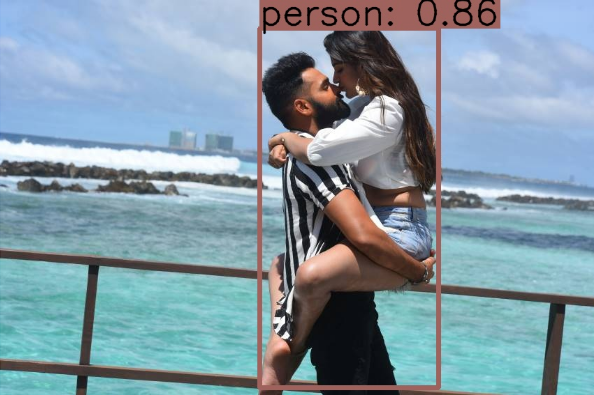

# Финальный проект DLS - демо сервис с детектором объектов

## Общий этап работы

**1) Выбор фреймворка/библиотеки для использования детектора.**
> Результатом пункта является зафиксированный фреймворк для нейросети-детектора.

Я решил выбрать следующие фреймворки для детектора:

1) [YOLOv5](https://github.com/ultralytics/yolov5) - отсюда берем веса модели. Если нужно, то учим модель этим фреймворком;
2) [YOLOv5-RT-STACK](https://github.com/zhiqwang/yolov5-rt-stack) - используем этот фреймворк для получения ONNX модели для инференса.
Был взят именно этот фреймворк, т.к. он при переводе в ONNX формат добавляет постпроцессинг в граф вычислений.
   
Я взял самую маленькую сеть - YOLOv5s.

**2) Запуск детектора на случайных изображениях**
> Результатом пункта явлется набор изображений, на которых модель успешно отработала и результат детекции виден и понятен.

Пример изображений находится ниже:

**3) Выбор фреймворка/библиотеки для разработки веб/мобильного демо**
> Результатом пункта является зафисированный для вас инстурмент для разработки демо.

Я буду делать веб-демо. Фреймворки перечислены ниже:

1) Backend: `FastAPI`, `ONNXRuntime`, `OpenCV`, `FFMPEG`;
2) Frontend: `Next.js`, `React`, `Material-UI`, `React-dropzone`. `Axios`.

**4) Разработка демо**
> Результатом пункта является код, который можно запустить. Не хватать будет только логики детектора, сам интерфейс должен быть уже рабочим.

Интерфейс находится в папке `frontend`.

**5) Встраивание модели-детектора в демо**
> Результатом пункта является код, который можно запустить и продемонстрировать работающую систему детектирования объектов.

Бизнес логика находится в папке `backend`.

**6) Тестирование демо**
Здесь нужно запустить ваше демо на как можно большем количестве примеров, чтобы понять, в чем его сильные и слабые стороны. То есть какие объекты/сцены детектор обрабатывает легко, а с какими ему справится сложно. Нужно предложить также пути для улучшения модели на основе увиденных ошибок.
> Результатом пункта является набор изображений, на которых демо отработало. Для каждого изображения нужно добавить комментарии, почему модель справилась хорошо/плохо, предложить пути ее улучшения.

 Много плотных объектов (близко друг к другу), поэтому модель не выделяет, например,
все бутылки на изображении. Есть визуальная схожесть между стулом и ноутбуком, поэтому модель их путает иногда. Это можно вылечить
другой архитектурой (например, IterDet для плотных объектов), либо запуском детектора на патчах из исходного изображения.

 Снова плотные объекты.

Я взял самую маленькую модель семейства YOLOv5, чтобы детектор работал более менее быстро.

## Как запустить?

Для запуска потребуется `Docker` и `Docker-Compose`.

1) Склонируйте репозиторий себе на машину;
2) Создайте `.env` файл рядом с `backend/.env.example` файлом со следующим содержимым

    VIDEO_API_BASE_PATH = http://127.0.0.1:
	PORT = 3001

3) Создайте `.env.local` пядом с `frontend/.env.production` файлом со следующим содержимым:

	NEXT_PUBLIC_API_URL=http://localhost:3001/

4) Выполните команду `docker-compose up`;
5) Откройте браузер и перейдите по адресу `http://localhost:3000`

